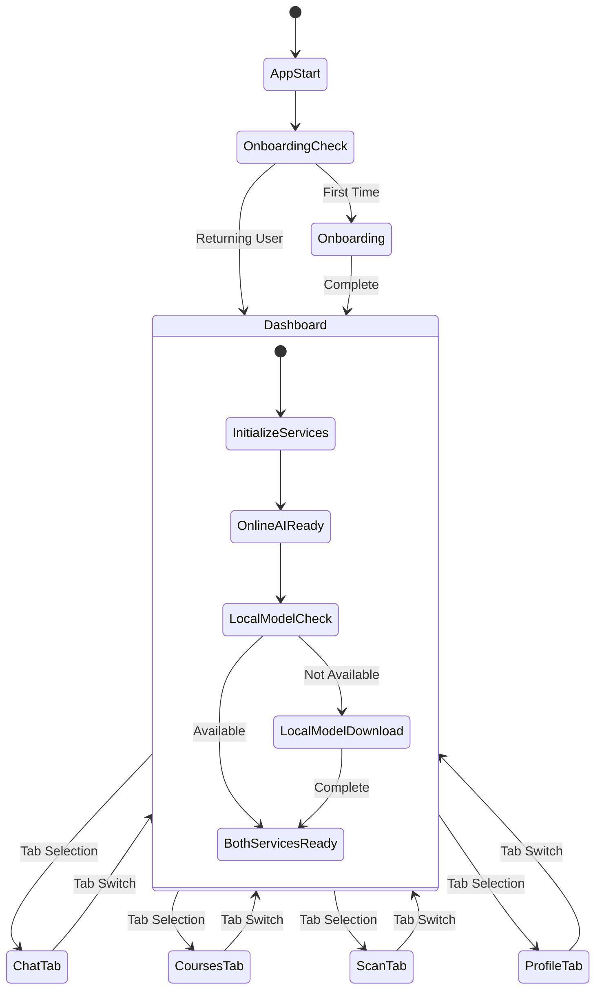

# Noor App Navigation and Flow Fixes Design

## Overview

This design document outlines the architecture for fixing critical navigation and app flow issues in the Noor learning app. The solution implements a dual AI service architecture (online + local), proper navigation controls, unified chat interfaces, and improved user experience flows. The design ensures users can immediately access all app features while optionally downloading local AI models for enhanced privacy and offline capability.

## Architecture

### High-Level Architecture

```
┌─────────────────────────────────────────────────────────────────┐
│                    Application Entry Point                     │
├─────────────────────────────────────────────────────────────────┤
│  main.dart → StudentDashboardScreen (with bottom navigation)   │
└─────────────────────────────────────────────────────────────────┘
                                │
┌─────────────────────────────────────────────────────────────────┐
│                    Navigation Architecture                     │
├─────────────────────────────────────────────────────────────────┤
│  BottomNavigationBar: [AI Chat | Courses | Scan | Profile]    │
│  ┌─────────────────┐  ┌─────────────────┐  ┌─────────────────┐ │
│  │ Unified Chat    │  │ Courses Screen  │  │ Camera Scanner  │ │
│  │ Interface       │  │                 │  │                 │ │
│  └─────────────────┘  └─────────────────┘  └─────────────────┘ │
└─────────────────────────────────────────────────────────────────┘
                                │
┌─────────────────────────────────────────────────────────────────┐
│                    Dual AI Service Layer                       │
├─────────────────────────────────────────────────────────────────┤
│  AIServiceManager                                               │
│  ┌─────────────────┐              ┌─────────────────┐          │
│  │ Online AI       │              │ Local AI        │          │
│  │ Service         │    ←→        │ Service         │          │
│  │ (Immediate)     │              │ (FlutterGemma)  │          │
│  └─────────────────┘              └─────────────────┘          │
└─────────────────────────────────────────────────────────────────┘
                                │
┌─────────────────────────────────────────────────────────────────┐
│                    Supporting Services                         │
├─────────────────────────────────────────────────────────────────┤
│  CourseContextService │ AchievementService │ OnboardingService │
└─────────────────────────────────────────────────────────────────┘
```

### Navigation Flow



## Components and Interfaces

### 1. Main Application Entry Point

Updated `main.dart` to route directly to dashboard:

```dart
class MyApp extends StatelessWidget {
  @override
  Widget build(BuildContext context) {
    return MaterialApp(
      title: 'Noor',
      theme: AppTheme.lightTheme,
      debugShowCheckedModeBanner: false,
      home: const AppInitializer(), // New wrapper component
    );
  }
}

class AppInitializer extends StatefulWidget {
  @override
  State<AppInitializer> createState() => _AppInitializerState();
}

class _AppInitializerState extends State<AppInitializer> {
  @override
  void initState() {
    super.initState();
    _initializeApp();
  }
  
  Future<void> _initializeApp() async {
    // Initialize services in background
    await AIServiceManager.instance.initialize();
    
    // Check if first time user
    final isFirstTime = await OnboardingService.isFirstTimeUser();
    
    if (mounted) {
      Navigator.pushReplacement(
        context,
        MaterialPageRoute(
          builder: (context) => isFirstTime 
              ? const OnboardingScreen()
              : const StudentDashboardScreen(),
        ),
      );
    }
  }
  
  @override
  Widget build(BuildContext context) {
    return const Scaffold(
      body: Center(
        child: Column(
          mainAxisAlignment: MainAxisAlignment.center,
          children: [
            CircularProgressIndicator(),
            SizedBox(height: 16),
            Text('Initializing Noor...'),
          ],
        ),
      ),
    );
  }
}
```

### 2. Enhanced Student Dashboard

Updated dashboard with proper navigation and service initialization:

```dart
class StudentDashboardScreen extends StatefulWidget {
  @override
  State<StudentDashboardScreen> createState() => _StudentDashboardScreenState();
}

class _StudentDashboardScreenState extends State<StudentDashboardScreen> {
  int _selectedIndex = 0;
  late List<Widget> _pages;
  
  @override
  void initState() {
    super.initState();
    _pages = [
      const UnifiedChatScreen(), // Replaces both AiChatScreen and GemmaChatPage
      const CoursesScreen(),
      const CameraScannerScreen(),
      const StudentProfileScreen(),
    ];
  }

  @override
  Widget build(BuildContext context) {
    return Scaffold(
      body: IndexedStack(
        index: _selectedIndex,
        children: _pages,
      ),
      bottomNavigationBar: BottomNavigationBar(
        items: const [
          BottomNavigationBarItem(
            icon: Icon(Icons.chat_bubble_outline),
            activeIcon: Icon(Icons.chat_bubble),
            label: 'AI Chat',
          ),
          BottomNavigationBarItem(
            icon: Icon(Icons.book_outlined),
            activeIcon: Icon(Icons.book),
            label: 'Courses',
          ),
          BottomNavigationBarItem(
            icon: Icon(Icons.camera_alt_outlined),
            activeIcon: Icon(Icons.camera_alt),
            label: 'Scan',
          ),
          BottomNavigationBarItem(
            icon: Icon(Icons.person_outline),
            activeIcon: Icon(Icons.person),
            label: 'Profile',
          ),
        ],
        currentIndex: _selectedIndex,
        type: BottomNavigationBarType.fixed,
        onTap: (index) => setState(() => _selectedIndex = index),
      ),
    );
  }
}
```

### 3. Dual AI Service Manager

Central service managing both online and local AI:

```dart
enum AIServiceMode {
  online,
  local,
  auto, // Prefer local, fallback to online
}

class AIServiceManager {
  static final AIServiceManager instance = AIServiceManager._();
  AIServiceManager._();
  
  OnlineAIService? _onlineService;
  FlutterGemmaService? _localService;
  AIServiceMode _currentMode = AIServiceMode.online;
  bool _isLocalModelAvailable = false;
  
  // Status streams
  final _statusController = StreamController<AIServiceStatus>.broadcast();
  Stream<AIServiceStatus> get statusStream => _statusController.stream;
  
  Future<bool> initialize() async {
    try {
      // Initialize online service first for immediate availability
      _onlineService = OnlineAIService();
      await _onlineService!.initialize();
      
      // Initialize local service in background
      _initializeLocalService();
      
      return true;
    } catch (e) {
      _statusController.add(AIServiceStatus.error(e.toString()));
      return false;
    }
  }
  
  Future<void> _initializeLocalService() async {
    try {
      _localService = FlutterGemmaService.instance;
      final success = await _localService!.initialize();
      
      if (success) {
        _isLocalModelAvailable = true;
        _statusController.add(AIServiceStatus.localReady());
        
        // Switch to local if user prefers it
        final prefs = await SharedPreferences.getInstance();
        final preferredMode = prefs.getString('ai_service_mode') ?? 'online';
        if (preferredMode == 'local' || preferredMode == 'auto') {
          _currentMode = AIServiceMode.values.firstWhere(
            (mode) => mode.toString().split('.').last == preferredMode,
            orElse: () => AIServiceMode.auto,
          );
        }
      }
    } catch (e) {
      // Local service failed, continue with online
      _statusController.add(AIServiceStatus.localError(e.toString()));
    }
  }
  
  Future<String> sendMessage(String message) async {
    switch (_currentMode) {
      case AIServiceMode.online:
        return await _onlineService!.sendMessage(message);
      case AIServiceMode.local:
        if (_isLocalModelAvailable) {
          return await _localService!.sendMessage(message);
        }
        // Fallback to online
        return await _onlineService!.sendMessage(message);
      case AIServiceMode.auto:
        if (_isLocalModelAvailable) {
          try {
            return await _localService!.sendMessage(message);
          } catch (e) {
            // Fallback to online
            return await _onlineService!.sendMessage(message);
          }
        }
        return await _onlineService!.sendMessage(message);
    }
  }
  
  Stream<String> sendMessageStream(String message) async* {
    switch (_currentMode) {
      case AIServiceMode.online:
        yield* _onlineService!.sendMessageStream(message);
        break;
      case AIServiceMode.local:
        if (_isLocalModelAvailable) {
          yield* _localService!.sendMessageStream(message);
        } else {
          yield* _onlineService!.sendMessageStream(message);
        }
        break;
      case AIServiceMode.auto:
        if (_isLocalModelAvailable) {
          try {
            yield* _localService!.sendMessageStream(message);
          } catch (e) {
            yield* _onlineService!.sendMessageStream(message);
          }
        } else {
          yield* _onlineService!.sendMessageStream(message);
        }
        break;
    }
  }
  
  Future<void> setMode(AIServiceMode mode) async {
    _currentMode = mode;
    final prefs = await SharedPreferences.getInstance();
    await prefs.setString('ai_service_mode', mode.toString().split('.').last);
    _statusController.add(AIServiceStatus.modeChanged(mode));
  }
  
  AIServiceMode get currentMode => _currentMode;
  bool get isLocalAvailable => _isLocalModelAvailable;
  bool get isOnlineAvailable => _onlineService != null;
}
```

### 4. Online AI Service

Simple HTTP-based AI service for immediate availability:

```dart
class OnlineAIService {
  static const String _baseUrl = 'https://api.your-ai-service.com'; // Replace with actual service
  final http.Client _client = http.Client();
  
  Future<bool> initialize() async {
    try {
      // Test connection to online service
      final response = await _client.get(
        Uri.parse('$_baseUrl/health'),
        headers: {'Content-Type': 'application/json'},
      ).timeout(const Duration(seconds: 5));
      
      return response.statusCode == 200;
    } catch (e) {
      return false;
    }
  }
  
  Future<String> sendMessage(String message) async {
    try {
      final response = await _client.post(
        Uri.parse('$_baseUrl/chat'),
        headers: {'Content-Type': 'application/json'},
        body: jsonEncode({
          'message': message,
          'stream': false,
        }),
      );
      
      if (response.statusCode == 200) {
        final data = jsonDecode(response.body);
        return data['response'] ?? 'No response received';
      } else {
        throw Exception('HTTP ${response.statusCode}: ${response.body}');
      }
    } catch (e) {
      throw Exception('Online AI service error: $e');
    }
  }
  
  Stream<String> sendMessageStream(String message) async* {
    try {
      final request = http.Request('POST', Uri.parse('$_baseUrl/chat/stream'));
      request.headers['Content-Type'] = 'application/json';
      request.body = jsonEncode({
        'message': message,
        'stream': true,
      });
      
      final response = await _client.send(request);
      
      if (response.statusCode == 200) {
        await for (final chunk in response.stream.transform(utf8.decoder)) {
          // Parse streaming response (adjust based on your API format)
          final lines = chunk.split('\n');
          for (final line in lines) {
            if (line.trim().isNotEmpty) {
              try {
                final data = jsonDecode(line);
                if (data['token'] != null) {
                  yield data['token'];
                }
              } catch (e) {
                // Skip malformed lines
              }
            }
          }
        }
      } else {
        throw Exception('HTTP ${response.statusCode}');
      }
    } catch (e) {
      yield 'Error: Online AI service unavailable. $e';
    }
  }
  
  void dispose() {
    _client.close();
  }
}
```

### 5. Unified Chat Screen

Single chat interface replacing both AiChatScreen and GemmaChatPage:

```dart
class UnifiedChatScreen extends StatefulWidget {
  @override
  State<UnifiedChatScreen> createState() => _UnifiedChatScreenState();
}

class _UnifiedChatScreenState extends State<UnifiedChatScreen> {
  final AIServiceManager _aiService = AIServiceManager.instance;
  final TextEditingController _textController = TextEditingController();
  final ScrollController _scrollController = ScrollController();
  final List<ChatMessage> _messages = [];
  
  bool _isGenerating = false;
  AIServiceStatus _serviceStatus = AIServiceStatus.initializing();
  
  @override
  void initState() {
    super.initState();
    _listenToServiceStatus();
  }
  
  void _listenToServiceStatus() {
    _aiService.statusStream.listen((status) {
      if (mounted) {
        setState(() {
          _serviceStatus = status;
        });
      }
    });
  }
  
  @override
  Widget build(BuildContext context) {
    return Scaffold(
      appBar: AppBar(
        title: const Text('AI Tutor'),
        actions: [
          // Service mode selector
          PopupMenuButton<AIServiceMode>(
            icon: Icon(_getServiceModeIcon()),
            onSelected: (mode) => _aiService.setMode(mode),
            itemBuilder: (context) => [
              PopupMenuItem(
                value: AIServiceMode.online,
                child: Row(
                  children: [
                    const Icon(Icons.cloud),
                    const SizedBox(width: 8),
                    const Text('Online'),
                    if (_aiService.currentMode == AIServiceMode.online)
                      const Icon(Icons.check, size: 16),
                  ],
                ),
              ),
              if (_aiService.isLocalAvailable)
                PopupMenuItem(
                  value: AIServiceMode.local,
                  child: Row(
                    children: [
                      const Icon(Icons.phone_android),
                      const SizedBox(width: 8),
                      const Text('Local'),
                      if (_aiService.currentMode == AIServiceMode.local)
                        const Icon(Icons.check, size: 16),
                    ],
                  ),
                ),
              if (_aiService.isLocalAvailable)
                PopupMenuItem(
                  value: AIServiceMode.auto,
                  child: Row(
                    children: [
                      const Icon(Icons.auto_mode),
                      const SizedBox(width: 8),
                      const Text('Auto'),
                      if (_aiService.currentMode == AIServiceMode.auto)
                        const Icon(Icons.check, size: 16),
                    ],
                  ),
                ),
            ],
          ),
        ],
      ),
      body: Column(
        children: [
          // Service status bar
          _buildServiceStatusBar(),
          
          // Messages
          Expanded(
            child: _buildMessageList(),
          ),
          
          // Input area
          _buildInputArea(),
        ],
      ),
    );
  }
  
  IconData _getServiceModeIcon() {
    switch (_aiService.currentMode) {
      case AIServiceMode.online:
        return Icons.cloud;
      case AIServiceMode.local:
        return Icons.phone_android;
      case AIServiceMode.auto:
        return Icons.auto_mode;
    }
  }
  
  // ... rest of the implementation
}
```

### 6. Course Context Service Implementation

Missing service that needs to be implemented:

```dart
class CourseContextService {
  static final CourseContextService instance = CourseContextService._();
  CourseContextService._();
  
  String? _currentCourseId;
  String? _currentModuleId;
  Map<String, dynamic> _userProgress = {};
  
  Future<void> initialize() async {
    await _loadUserProgress();
  }
  
  Future<void> _loadUserProgress() async {
    final prefs = await SharedPreferences.getInstance();
    final progressJson = prefs.getString('user_progress');
    if (progressJson != null) {
      _userProgress = jsonDecode(progressJson);
    }
  }
  
  Future<void> setCurrentCourse(String courseId, {String? moduleId}) async {
    _currentCourseId = courseId;
    _currentModuleId = moduleId;
    
    final prefs = await SharedPreferences.getInstance();
    await prefs.setString('current_course', courseId);
    if (moduleId != null) {
      await prefs.setString('current_module', moduleId);
    }
  }
  
  String? get currentCourseId => _currentCourseId;
  String? get currentModuleId => _currentModuleId;
  
  Map<String, dynamic> getCourseProgress(String courseId) {
    return _userProgress[courseId] ?? {};
  }
  
  Future<void> updateProgress(String courseId, String moduleId, double progress) async {
    _userProgress[courseId] ??= {};
    _userProgress[courseId][moduleId] = progress;
    
    final prefs = await SharedPreferences.getInstance();
    await prefs.setString('user_progress', jsonEncode(_userProgress));
  }
  
  String getContextForAI() {
    if (_currentCourseId == null) return '';
    
    final courseProgress = getCourseProgress(_currentCourseId!);
    return 'User is currently in course $_currentCourseId'
           '${_currentModuleId != null ? ', module $_currentModuleId' : ''}'
           '. Progress: ${courseProgress.toString()}';
  }
}
```

## Data Models

### 1. AI Service Status

```dart
class AIServiceStatus {
  final AIServiceStatusType type;
  final String? message;
  final double? progress;
  final AIServiceMode? mode;
  
  const AIServiceStatus({
    required this.type,
    this.message,
    this.progress,
    this.mode,
  });
  
  factory AIServiceStatus.initializing() => const AIServiceStatus(
    type: AIServiceStatusType.initializing,
    message: 'Initializing AI services...',
  );
  
  factory AIServiceStatus.onlineReady() => const AIServiceStatus(
    type: AIServiceStatusType.onlineReady,
    message: 'Online AI service ready',
  );
  
  factory AIServiceStatus.localReady() => const AIServiceStatus(
    type: AIServiceStatusType.localReady,
    message: 'Local AI model ready',
  );
  
  factory AIServiceStatus.error(String error) => AIServiceStatus(
    type: AIServiceStatusType.error,
    message: error,
  );
  
  factory AIServiceStatus.modeChanged(AIServiceMode mode) => AIServiceStatus(
    type: AIServiceStatusType.modeChanged,
    mode: mode,
  );
}

enum AIServiceStatusType {
  initializing,
  onlineReady,
  localReady,
  localError,
  error,
  modeChanged,
}
```

### 2. Chat Message

```dart
abstract class ChatMessage {
  final String id;
  final String text;
  final bool isUser;
  final DateTime timestamp;
  
  ChatMessage({
    String? id,
    required this.text,
    required this.isUser,
    DateTime? timestamp,
  }) : id = id ?? _generateId(),
       timestamp = timestamp ?? DateTime.now();
  
  static String _generateId() => DateTime.now().millisecondsSinceEpoch.toString();
}

class TextChatMessage extends ChatMessage {
  TextChatMessage({
    String? id,
    required String text,
    required bool isUser,
    DateTime? timestamp,
  }) : super(id: id, text: text, isUser: isUser, timestamp: timestamp);
}

class ImageChatMessage extends ChatMessage {
  final Uint8List imageBytes;
  
  ImageChatMessage({
    String? id,
    required String text,
    required this.imageBytes,
    required bool isUser,
    DateTime? timestamp,
  }) : super(id: id, text: text, isUser: isUser, timestamp: timestamp);
}
```

## Error Handling

### 1. Service Error Recovery

```dart
class AIServiceErrorHandler {
  static Future<String> handleError(dynamic error, AIServiceMode currentMode) async {
    if (error is http.ClientException) {
      // Network error - try switching to local if available
      if (currentMode == AIServiceMode.online && AIServiceManager.instance.isLocalAvailable) {
        await AIServiceManager.instance.setMode(AIServiceMode.local);
        return 'Switched to local AI due to network issues. Please try again.';
      }
      return 'Network error. Please check your connection and try again.';
    }
    
    if (error is GemmaException) {
      switch (error.type) {
        case GemmaErrorType.modelNotFound:
          return 'Local AI model not found. Using online service.';
        case GemmaErrorType.memoryError:
          return 'Memory error. Try a shorter message or restart the app.';
        default:
          return 'AI service error: ${error.message}';
      }
    }
    
    return 'Unexpected error: $error';
  }
}
```

## Testing Strategy

### 1. Navigation Testing

```dart
// Test navigation flow
testWidgets('App starts with dashboard', (tester) async {
  await tester.pumpWidget(const MyApp());
  await tester.pumpAndSettle();
  
  expect(find.byType(StudentDashboardScreen), findsOneWidget);
  expect(find.byType(BottomNavigationBar), findsOneWidget);
});

testWidgets('Bottom navigation switches tabs', (tester) async {
  await tester.pumpWidget(const MyApp());
  await tester.pumpAndSettle();
  
  // Tap courses tab
  await tester.tap(find.text('Courses'));
  await tester.pumpAndSettle();
  
  expect(find.byType(CoursesScreen), findsOneWidget);
});
```

### 2. AI Service Testing

```dart
// Test dual AI service
testWidgets('AI service switches between online and local', (tester) async {
  final aiService = AIServiceManager.instance;
  await aiService.initialize();
  
  // Test online mode
  await aiService.setMode(AIServiceMode.online);
  final onlineResponse = await aiService.sendMessage('Hello');
  expect(onlineResponse, isNotEmpty);
  
  // Test local mode (if available)
  if (aiService.isLocalAvailable) {
    await aiService.setMode(AIServiceMode.local);
    final localResponse = await aiService.sendMessage('Hello');
    expect(localResponse, isNotEmpty);
  }
});
```

## Migration Plan

### Phase 1: Core Navigation Fixes
1. Update main.dart to route to dashboard
2. Remove ModelCheckWrapper from main entry
3. Create AppInitializer component
4. Update StudentDashboardScreen with IndexedStack
5. Test basic navigation flow

### Phase 2: Dual AI Service Implementation
1. Create AIServiceManager
2. Implement OnlineAIService
3. Create UnifiedChatScreen
4. Remove duplicate chat implementations
5. Test AI service switching

### Phase 3: Missing Services
1. Implement CourseContextService
2. Connect achievement system to UI
3. Create OnboardingService
4. Test service integrations

### Phase 4: Enhanced UX
1. Improve model download experience
2. Add service status indicators
3. Implement error recovery
4. Polish UI and animations

## Security Considerations

1. **API Security**: Online AI service should use proper authentication
2. **Local Data**: All local processing maintains user privacy
3. **Service Switching**: Secure handling of service mode preferences
4. **Error Handling**: No sensitive information in error messages

## Performance Optimizations

1. **Service Initialization**: Background initialization of local service
2. **Memory Management**: Proper disposal of services and streams
3. **Navigation**: IndexedStack for fast tab switching
4. **Caching**: Cache service responses where appropriate
5. **Background Processing**: Model downloads don't block UI